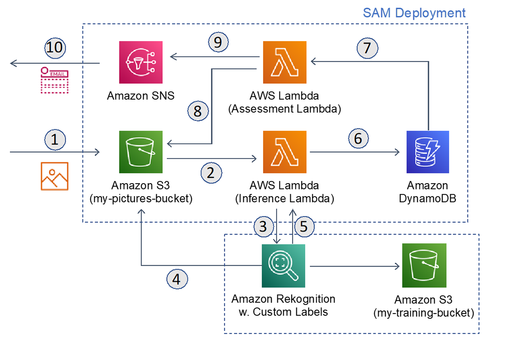

# 🌬️ AI-Driven Wind Turbine Visual Inspection

> Automated defect detection system for wind turbines using drone imagery, AWS Rekognition Custom Labels, and serverless architecture



## 📋 Overview

This project demonstrates an end-to-end serverless solution for automated visual inspection of wind turbines using drone-captured images. The system leverages AWS Rekognition Custom Labels to detect defects such as icing, wear, and corrosion, automatically alerting maintenance teams when issues are identified.

### Key Features

- **Automated Image Processing**: Triggered automatically when drone images are uploaded to S3
- **Custom ML Detection**: Uses AWS Rekognition Custom Labels for defect identification
- **Real-time Notifications**: SNS-based alerting system for critical defects
- **Scalable Architecture**: Fully serverless design that scales automatically
- **Audit Trail**: DynamoDB storage for all inspection results with timestamps

## 🏗️ Architecture

The solution uses a serverless event-driven architecture:

1. **Image Upload**: Drone images uploaded to S3 bucket trigger the first Lambda function
2. **ML Inference**: Rekognition Custom Labels analyzes images for defects (icing, wear, corrosion)
3. **Results Storage**: Inference results stored in DynamoDB with metadata
4. **Alert Processing**: DynamoDB Streams trigger second Lambda to evaluate results
5. **Notifications**: SNS sends email alerts when defects exceed confidence threshold

### AWS Services Used

- **AWS Lambda**: Serverless compute for image processing and alerting
- **Amazon Rekognition Custom Labels**: ML-based defect detection
- **Amazon S3**: Storage for drone images
- **Amazon DynamoDB**: NoSQL database for inspection results
- **Amazon SNS**: Email notifications for detected issues
- **AWS SAM**: Infrastructure as Code deployment

## 🚀 Getting Started

### Prerequisites

- AWS Account with appropriate permissions
- AWS CLI configured
- AWS SAM CLI installed
- Trained Amazon Rekognition Custom Labels model

### Deployment

1. Clone the repository:

```bash
git clone <repository-url>
cd <repository-name>
```

2. Update the SAM template parameters in `SAM-repo/template.yaml`:

   - `CustomLabelsEndpoint`: Your Rekognition Custom Labels model ARN
   - `MyEmailAdress`: Email address for notifications
   - `MyLabelListToBeNotified`: Comma-separated list of defects to monitor
   - `ThresholdForNotification`: Confidence threshold percentage (default: 75)

3. Deploy using SAM CLI:

```bash
cd SAM-repo
sam build
sam deploy --guided
```

4. Confirm the SNS subscription email sent to your inbox

### Usage

Upload drone images to the created S3 bucket:

```bash
aws s3 cp turbine-image.jpg s3://windturbine-pictures-get-photo/
```

The system will automatically:

- Process the image with Rekognition Custom Labels
- Store results in DynamoDB
- Send email alerts if defects exceed the threshold

## 📁 Project Structure

```
.
├── SAM-repo/
│   ├── template.yaml                          # SAM infrastructure template
│   ├── MyCustomRekognitionLambda/
│   │   └── MyCustomRekognitionLambda.py      # Image processing Lambda
│   └── MyDynamodbLambda/
│       └── MyDynamodbLambda.py               # Alert processing Lambda
├── arch.png                                   # Architecture diagram
└── README.md
```

## 🔧 Configuration

### Environment Variables

**MyCustomRekognitionLambda**:

- `CustomLabels_ModelArn`: ARN of the Rekognition Custom Labels model
- `Confidence_Threshold`: Minimum confidence score (0-100)
- `DynamoDB_Table`: Name of the DynamoDB table

**MyDynamodbLambda**:

- `AlarmingLabelList`: Comma-separated defect types to monitor
- `TopicArn`: SNS topic ARN for notifications
- `Threshold`: Confidence threshold for alerts (0-100)

## 📊 Sample Output

When a defect is detected, you'll receive an email notification:

```
Subject: A Possible issue detected at Turbine

ALARM! :icing (Confidence: 87.5)
ALARM! :wear (Confidence: 92.3)

Please see the photo: [presigned S3 URL]
```

## 🛡️ Security

- S3 bucket configured with public access blocked
- IAM roles follow least privilege principle
- Presigned URLs for secure image access (1-hour expiration)

See [CONTRIBUTING](CONTRIBUTING.md#security-issue-notifications) for security issue notifications.

## 🔮 Future Enhancements

- [ ] Dashboard for visualization of inspection history
- [ ] Integration with maintenance scheduling systems
- [ ] Multi-region deployment support
- [ ] Cost optimization with S3 lifecycle policies
- [ ] API Gateway for programmatic access

## 📝 License

This library is licensed under the MIT-0 License. See the [LICENSE](LICENSE) file.

## 🤝 Contributing

Contributions are welcome! Please see [CONTRIBUTING.md](CONTRIBUTING.md) for details.

---

**Note**: This is a demonstration project showcasing serverless architecture and ML integration. For production use, additional considerations for error handling, monitoring, and security hardening are recommended.
